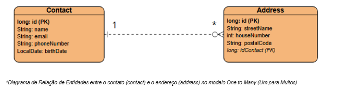
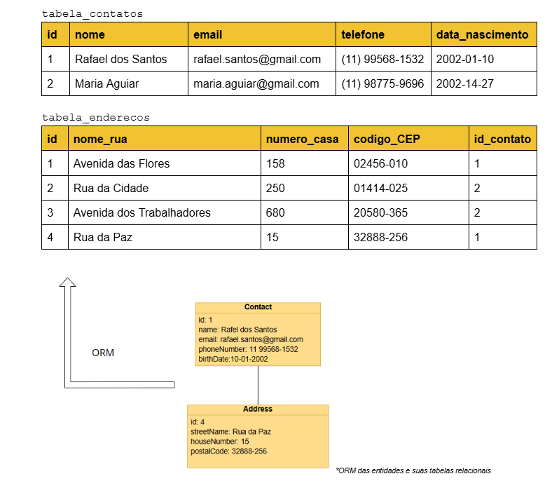
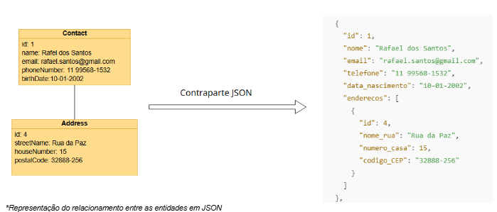

# 📞PROJETO - Connectiva - API Para Gerenciamento de Contatos
Url da API - https://projeto-connectiva-api-de-gerenciamento.onrender.com/api/v2/
##  📝 Descrição Geral
O *Connectiva* é uma **API RESTful** desenvolvida em **Java 17** com **Spring Boot 3.4.2**, projetada para gerenciar contatos e seus respectivos endereços por meio de requisições HTTP. Os dados são armazenados em um banco de dados relacional e as requisições permitem a execução de todas as operações CRUD (*Create*, *Read*, *Update* & *Delete*)

##  📎 Índice
1.  📖 Visão Geral do Sistema
2.  💽 Tech-Stack
3.  📁 Estrutura do Projeto
4.  💨 Guia para execução local
5.  📦 Dados e Formatos
6.  📤 Endpoints suportados pela API
7.  💻 Implementações
8.  🛠️ Histórico de Alterações
9.  ⚠️ Limitações

##  📖 Visão Geral do Sistema
O principal objetivo do *Connectiva* é gerenciar os dados de contatos e seus respectivos endereços, armazenando essas informações em um banco de dados relacional e manipulando-as a partir de chamadas HTTP expostas na API por endpoints **GET**, **PUT**, **POST**, **PATCH** e, por fim, **DELETE**.

Ela permite casos de uso específicos e pertinentes ao contexto de cadastro de entidades:

- Listar todos os contatos cadastrados junto a todos os endereços associados;
- Listar todos os endereços armazenados no banco de dados individualmente;
- Cadastrar novos contatos;
- Editar os contatos existentes bem como os endereços vinculados à eles;
- Deletar um contato da *database*, excluindo todos os endereços associados à ele;
- Deletar um endereço da base da dados.

O sistema gerencia duas entidades ligadas entre si em um relacionamento *One-to-Many*, onde **UM** Contato pode estar relacionado à **UM OU MAIS** Endereços, como o modelo lógico conceitual demonstra



A partir dele, são criadas as entidades **Endereço** e **Contato** em classes diferentes que serão gerenciadas pelo _JPA_ e transformadas em tabelas pelo _Hibernate_ (implementação de ORM) - como o modelo demonstra:



Por fim, também há o processo de serialização e desserialização, manejado pela anotações como **@JsonManagedReference** e **@JsonBackReference**, garantindo que a serialização seja controlada, sem redundâncias e recursões infinitas devido os relacionamento *One-To-Many* e *Many-to-One*, garantindo que tanto as requisições quanto as respostas estejam em no formato proposto pelo modelo:




##  💽 Tech-Stack
 
 
 
  

##  📁 Estrutura do Projeto

`src` \
├── `main` \
│   ├── `java` \
│   │   └── `com.connectiva.app.rest_api_connectiva` \
│   │       ├── `controller`  - Camada que receve requisições HTTP e direcioná-aas para a lógica de serviço. \
│   │       ├── `model`  - Representação das entidades do sistema e seu mapeamento para o banco de dados. \
│   │       ├── `repository`  - Interface de comunicação com o banco de dados via JPA/Hibernate. \
│   │       ├── `service`  -  Contém a lógica de perações sobre as entidades. \
│   │       ├── `utils`  - Classes auxiliares para funcionalidades específicas, como manipulação de requisições. \
│   ├── `resources` \
│   │   └── `application.properties`  - Arquivo de configuração da aplicação.


##  💨 Guia para execução local
Para executar esta API RESTful de Gerenciamento de Contatos localmente é recomendável utilizar o Postman para testar os endpoints em **localhost:8080** e configurar a aplicação para utilizar o **PostgreSQL** ou,  preferir, o **MySQL**.
### Requisitos
-   **Java 17**;
-   **Maven 3.9.9** (ou versão compatível);
-   Banco de dados **PostgreSQL** (ou **MySQL**).
-   **Postman** ou ferramenta similar para testar os endpoints

### Passo a Passo

#### 1. Clonar o Repositório

Clonar o repositório do projeto para máquina local:

```bash
git clone https://github.com/DeVinc1/PROJETO-API-Gerenciamento-Contatos.git
```

####  2. Configuração do Banco de Dados

#####  Utilizando PostgreSQL

Configurar a aplicação com PostgreSQL,  modificando o arquivo `application.properties` para definir as variáveis de conexão:

```properties
spring.application.name=API-restful-connectiva

# Configuração do Servidor
server.port=8080

# Configuração do Banco de Dados (PostgreSQL)
spring.datasource.url=${DB_CONNECTION}
spring.datasource.username=${DB_USERNAME}
spring.datasource.password=${DB_PASSWORD}
spring.datasource.driver-class-name=org.postgresql.Driver

# Configuração do Connection Pool
spring.datasource.hikari.maximum-pool-size=10
spring.datasource.hikari.minimum-idle=5
spring.datasource.hikari.connection-timeout=30000
spring.datasource.hikari.idle-timeout=300000
spring.datasource.hikari.max-lifetime=1800000
spring.datasource.hikari.pool-name=HikariPool-PostgreSQL

# Configuração do Hibernate
spring.jpa.show-sql=true
spring.jpa.hibernate.ddl-auto=update
spring.jpa.properties.hibernate.dialect=org.hibernate.dialect.PostgreSQLDialect
spring.jpa.properties.hibernate.format_sql=true

```

É necessário substituir `DB_CONNECTION`, `DB_USERNAME` e `DB_PASSWORD` pela URL da base de dados e as credenciais (ou defina-las nas variáveis de ambiente do sistema) de acordo com a configuração local do **PostgreSQL**:

-   **DB_CONNECTION**: `jdbc:postgresql://localhost:5432/nome_do_banco`
-   **DB_USERNAME**: `seu_usuario`
-   **DB_PASSWORD**: `sua_senha`

##### Utilizando MySQL

Para utilizar o MySQL, modifica-se o arquivo de propriedades para adequar os drivers de conexão, o *connection pool* e o *dialeto do JPA* ao MySQL:

```properties
spring.application.name=API-restful-connectiva

# Configuração do Servidor
server.port=8080

# Configuração do Banco de Dados (MySQL)
spring.datasource.url=${DB_CONNECTION}
spring.datasource.username=${DB_USERNAME}
spring.datasource.password=${DB_PASSWORD}
spring.datasource.driver-class-name=com.mysql.cj.jdbc.Driver

# Configuração do Connection Pool
spring.datasource.hikari.maximum-pool-size=10
spring.datasource.hikari.minimum-idle=5
spring.datasource.hikari.connection-timeout=30000
spring.datasource.hikari.idle-timeout=300000
spring.datasource.hikari.max-lifetime=1800000
spring.datasource.hikari.pool-name=HikariPool-MySQL

# Configuração do Hibernate
spring.jpa.show-sql=true
spring.jpa.hibernate.ddl-auto=update
spring.jpa.properties.hibernate.dialect=org.hibernate.dialect.MySQL8Dialect
spring.jpa.properties.hibernate.format_sql=true
```

Também substitua (`DB_CONNECTION`, `DB_USERNAME` e `DB_PASSWORD`) pela URL da base de dados e as credenciais (ou defina-as nas variáveis de ambiente do sistema) de acordo com sua configuração local do **MySQL**:

-   **DB_CONNECTION**: `jdbc:mysql://localhost:3306/nome_do_banco?useSSL=false&serverTimezone=UTC`
-   **DB_USERNAME**: `seu_usuario`
-   **DB_PASSWORD**: `sua_senha`


### 3. Compilação e Execução

Com o repositório clonado e o arquivo de configuração ajustado, compile e execute a aplicação utilizando o Maven:

```bash
mvn clean package -DskipTests  
mvn clean install -DskipTests
mvn spring-boot:run
```
Ou utilizar IDEs com funções de execução embarcadas (como *IntelliJ* ou *VS Code*)

A aplicação iniciará na porta  **8080** (configurada em `application.properties`).

### 4. Testando a API com o Postman

Para testar a API, basta abrir o **Postman** (ou semelhante) e enviar requisições para os endpoints da API, utilizando a URL base:

```
http://localhost:8080/api/v2/
```

Para verificar todos os endpoints existem, basta consultar a documentação do **Swagger**, disponível na aplicação em `http://localhost:8080/swagger-ui/index.html`.

##  📦 Dados e Formatos
Os dados manipulados pela API são divididos em duas tabelas (`tabela_contatos` e `tabela_endereços`), as quais armazenam os seguintes dados:
#### tabela_contatos
| Campo     | Tipo   | Descrição                  | Formatação | 
|-----------|--------|----------------------------|-----------|
| id        |Long    | ID único do contato.       ||
| nome      | String | Nome do contato.           ||
| email     | String | E-mail do contato.         |email@dominio.extensão|
| telefone  | Sstring | Telefone do contato.       |(XX) xxxx-xxxx ou (XX) 9xxxx-xxxx|
| data_nascimento| LocalDate| Data de Nascimento do contato.       |AAAA-MM-DD|
| enderecos | List<Address\>  | Lista de endereços do contato. ||

#### tabela_endereço

| Campo      | Tipo   | Descrição                  | Formatação | 
|------------|--------|----------------------------| -------------| 
| id         | Long    | ID único do endereço.      | |
| nome_rua| String | Nome da rua/avenida.       | |
| numero_casa     | String | Número do endereço.        | |
| codigo_CEP| String | Código postal do endereço.        | xxxxx-xxx|
| id_contato| Long | Chave Estrangeira que referencia o contato associado ao endereço.        |


##  📤 Endpoints suportados pela API
Acesse todos os endpoints a partir da documentação Swagger presente em https://projeto-connectiva-api-de-gerenciamento.onrender.com/swagger-ui/index.html

Para os **contatos**, ela suporta requisições de endpoint:

- GET;
- POST;
- PUT;
- PATCH;
- DELETE;

Para os **endereços**, ela suporta as requisições:

- GET;
- DELETE;


##  💻 Implementações
O pacote `Utils` possui implementações de algoritmos para realizar correções no Corpo de Requisição enviado para a função PATCH que são pertinentes ao contexto da documentação


### Funções

#### `nullPropertySkipper`

```java
public <T> T nullPropertySkipper(T originalProperty, T sentProperty) {
    if (sentProperty == null) {
        return originalProperty;
    } else {
        return sentProperty;
    }
}

```
**Descrição:**  
Esta função verifica se a propriedade enviada (`sentProperty`) é nula. Se for nula, retorna a propriedade original (`originalProperty`); caso contrário, retorna a propriedade enviada.

----------

#### `contactPatcher`

```java
public Contact contactPatcher(Contact existingContact, Contact sentContact) {
    sentContact = contactPropertyMerge(existingContact, sentContact);
    List<Address> addresses = new ArrayList<>();
    addresses.addAll(addressPropertyPatcher(existingContact, sentContact));
    addresses.addAll(addressObjectMerge(existingContact, sentContact));
    addresses.addAll(newAddressCatcher(sentContact));
    sentContact.setAddressesAssociated(addresses);
    return sentContact;
}

```
**Descrição:**  
Esta função corrige um objeto `Contact`, combinando os dados existentes e enviados, atualizando as propriedades e listas de endereços associadas.

----------

#### `contactPropertyMerge`

```java
public Contact contactPropertyMerge(Contact existingContact, Contact sentContact) {
    sentContact.setId(existingContact.getId());
    sentContact.setName(nullPropertySkipper(existingContact.getName(), sentContact.getName()));
    sentContact.setEmail(nullPropertySkipper(existingContact.getEmail(), sentContact.getEmail()));
    sentContact.setPhoneNumber(nullPropertySkipper(existingContact.getPhoneNumber(), sentContact.getPhoneNumber()));
    sentContact.setBirthDate(nullPropertySkipper(existingContact.getBirthDate(), sentContact.getBirthDate()));
    return sentContact;
}

```

**Descrição:**  
Esta função mescla as propriedades do objeto `Contact` enviadas com as propriedades existentes, mantendo os valores originais caso as enviadas sejam nulas.

----------

#### `addressPropertyPatcher`

```java
public List<Address> addressPropertyPatcher(Contact existingContact, Contact sentContact) {
    List<Address> existingAddresses = existingContact.getAddressesAssociated();
    List<Address> sentAddresses = sentContact.getAddressesAssociated();
    for (Address existingAddress : existingAddresses) {
        for (Address sentAddress : sentAddresses) {
            if (existingAddress.getId().equals(sentAddress.getId())) {
                sentAddress.setStreetName(nullPropertySkipper(existingAddress.getStreetName(), sentAddress.getStreetName()));
                sentAddress.setHouseNumber(nullPropertySkipper(existingAddress.getHouseNumber(), sentAddress.getHouseNumber()));
                sentAddress.setPostalCode(nullPropertySkipper(existingAddress.getPostalCode(), sentAddress.getPostalCode()));
            }
        }
    }
    return sentAddresses;
}

```

**Descrição:**  
Esta função atualiza as propriedades dos endereços enviados, mantendo os dados originais caso as propriedades enviadas sejam nulas.

----------

#### `addressObjectMerge`

```java
public List<Address> addressObjectMerge(Contact existingContact, Contact sentContact) {
    List<Address> existingAddresses = existingContact.getAddressesAssociated();
    List<Address> sentAddresses = sentContact.getAddressesAssociated();
    List<Address> addressesToAdd = new ArrayList<>();
    for (int i = existingAddresses.size() - 1; i >= 0; i--) {
        Address existingAddress = existingAddresses.get(i);
        boolean isUnique = true;
        for (Address sentAddress : sentAddresses) {
            if (Objects.equals(existingAddress.getId(), sentAddress.getId())) {
                isUnique = false;
                break;
            }
        }
        if (isUnique) {
            addressesToAdd.add(existingAddress);
            existingAddresses.remove(i);
        }
    }
    return addressesToAdd;
}

```

**Descrição:**  
Esta função verifica e combina objetos `Address` de contatos existentes e enviados, adicionando os endereços únicos (presentes apenas no existente) à lista consolidada.

----------

#### `newAddressCatcher`

```java
public List<Address> newAddressCatcher(Contact sentContact) {
    List<Address> sentAddresses = sentContact.getAddressesAssociated();
    List<Address> newAddressesSent = new ArrayList<>();
    for (int i = sentAddresses.size() - 1; i >= 0; i--) {
        Address sentAddress = sentAddresses.get(i);
        if (sentAddress.getId() == null) {
            newAddressesSent.add(sentAddress);
            sentAddresses.remove(i);
        }
    }
    return newAddressesSent;
}

```

**Descrição:**  
Esta função captura novos endereços enviados que não possuem ID, removendo-os da lista original e adicionando-os a uma nova lista de endereços enviados.

## 🛠️ Histórico de Alterações
### v 2.0.0 - 1º Release Pública - 04/02/2025
- Primeira Release pública;
- API hospedada no render.com em https://projeto-connectiva-api-de-gerenciamento.onrender.com/;
- Banco de Dados hospedado no render.com sob o regime PostgreSQL;

## ⚠️ Limitações
Atualmente, a API não conta com mecanismos de segurança – como o `OAuth2` – para restringir o acesso às operações críticas (cadastro, edição e exclusão) apenas a usuários autorizados.

Em termos de desempenho, a API não utiliza `FetchType.EAGER` para evitar o carregamento excessivo de dados e possíveis problemas de performance em consultas desnecessárias.

As funções da classe `utils` também não seguem as melhores práticas de otimização, pois utilizam loops `for-each` aninhados para evitar que propriedades nulas nas requisições **PATCH** sobrescrevam as propriedades originais no banco de dados, o que pode resultar em uma complexidade de tempo elevada (`O(n^2)`) ao processar grandes volumes de dados. Isso pode impactar o desempenho da aplicação, especialmente em cenários com um grande número de contatos e endereços associados.

Por fim, a API não utiliza **DTOs (Data Transfer Objects)** para a transferência de dados entre as camadas da aplicação, o que pode trazer implicações para a organização e manutenção do código, já que atualmente, as entidades de domínio são diretamente expostas nas respostas da API e usadas como parâmetros nos métodos dos *controllers*.